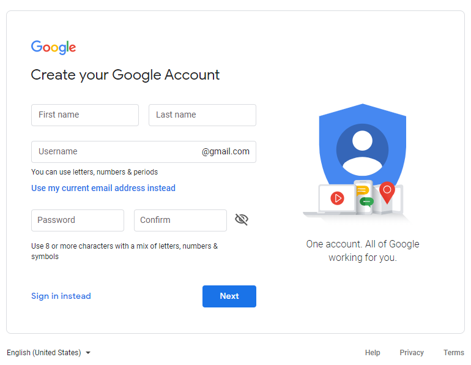

# Weekly Project - 02

Task guidelines for second weekly project.

**Dated: 13th May 2020**

**Submission Deadline: 17th May 2020**

**Submission method**

You have to submit the task by simply uploading your files on github and pasting the link of the repository on the task submission sheet. Also host your website and paste the URL of the website in the readme file of the project for better assessment. 

## Objective
> To design google sign up form.

## Prerequisites 

### HTML 

- DOM Tree
- Semantic tags
- Presentational tags
- Form and input tags

### CSS

- Basic style properties
- Selectors
- Color convention
- CSS Positioning
- Pseudoclasses
- Combinators
- Flexbox

You have studied the offline lessons given to you and have taken quizzes to self-assess yourself.

## Overview of the Task

The task is to design the google signup form. The mockup is also provided to you further down this page. Remember your code should meet all the milestones mentioned below. Milestones are simply small objectives or user stories that you must fulfil when writing code.

## Mockup Details

You have to design a webform similar to the mockup provided. Scroll down the page to see the mockup image of the webform.
## Milestones of the Project

Please ensure that no milestone is left incomplete. Further if you have difficulty in achieving a milestone, simply google it. You ll get plenty of relevant answers. If you still face the issue, you can always connect to the TAs.

##### Milestone #1: 
> All fields in your form must be required. If the user does not fill a single field or more than one field and clicks on 'next' the form should not be accepted showing relevant errros.

##### Milestone #2:  
> The way the error should be highlighted is that the field the user leaves empty should be outlined in red and the error message should come below it. For example if the user forgets to enter last name and clicks on next, the input box for lastname should be outlined in red, and error message 'Last name is required' should come below it. The error message should have a red exclaimation as well in the begining. See the second mockup image attached below for clearity.

##### Milestone #3:  
> The password must be showed to the user as dots for security concerns and not as text

##### Milestone #4: 
> The user must provide minimum of 8 characters for password. If the user provides less than 8 characters, the error message should show "Password should be at least 8 characters".

##### Milestone #5:  
> The input boxes: first name and last name should accept data in form of text

##### Milestone #6: 
> The username should be an email address. If the user provides an invalid email, it should show the error in a similar way as mentioned above.

##### Milestone #7: 
> All input field should have relevant placeholders

##### Milestone #8: 
> When you click on any input, the placeholder there should be showed on the input box as could be seen in the mockup image as well.

###### GOOD LUCK!

##### MOCKUP IMAGE ATTACHED BELOW

Basic form mockup 

Error handling mockup 

